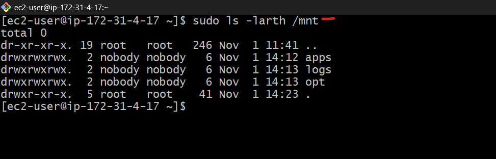

# Devops-Training-Website-Solution
## Implementing a business website using NFS for the backend file storage

I implemented a WordPress-based solution that is now ready to be used as a fully functional website or blog.

 I will be adding more value to this solution by implementing a tooling website solution that makes access to DevOps tools within the corporate infrastructure easily accessible.

I will introduce a set of DevOps tools that will help a team in day to day activities in managing, developing, testing, deploying and monitoring different projects. These tools are well known and widely used by multiple DevOps teams, so i will introduce a single DevOps Tooling Solution that will consist of:

- [Jenkins](https://jenkins.io/)

- [Kubernetes](https://kubernetes.io/)

- [Jfrog Artifactory](https://jfrog.com/artifactory/)

- [Rancher](https://www.rancher.com/)

- [Grafana](https://grafana.com/)

- [Prometheus](https://prometheus.io/)

- [Kibana](https://www.elastic.co/kibana)

In this project, you will implement a solution that consists of the following components:

__Infrastructure:__ AWS

__Webserver Linux:__ Red Hat Enterprise Linux 8

__Database Server:__ Ubuntu 20.04 + MySQL

__Storage Server:__ Red Hat Enterprise Linux 8 + NFS Server 

__Programming Language:__ PHP

__Code Repository.__ Github

__Architecture__

We will be implementing a solution that comprises multiple web servers sharing a common database and also accessing the same files using Network File System (NFS) as shared file storage.

## Implementing a business website using NFS for the backend file storage.

Creating a business website that uses Network File System (NFS) for backend file storage is a viable option, especially if you need to share and manage files across multiple servers. Here are the steps to implement such a set up:

__step 1 - Prepare NFS server__

- Launch an EC2 instance with RHEL(Red Hat) Linux 9 operating system that will serve as an "NFS-Server".

Result:

- This instance should have three volumes same as your EC2 instance, each of 10 GB and attach each to the instance.

Result:

- Based on the steps documented in my previous project [web-solution-with-wordpress](https://github.com/ogechukwu1/Web-Solution-With-Wordpress), we Configured the __App and DB Servers__, also configured LVM on the server but in this case:

- Instead of formatting the disks as `ext4`, we will be formatting them as `xfs`.

- Ensure there are 3 __Logical Volumes.__
 `lv-opt` `lv-apps`, and `lv-logs`

- Create mount points on `/mnt` directory for the logical volumes as follows:

     Mount `lv-apps` on `/mnt/apps` – To be used by web servers

   Mount `lv-logs` on `/mnt/logs` – To be used by web server logs

   Mount `lv-opt` on `/mnt/opt` – To be used by Jenkins server in a future project.

To list block devices and display disk space usage on your system

`$ sudo lsblk`

`$ sudo df -h`

Result:

Create Partitions by running the below commands and follow the prompts as documented previously to partition all three block storages.

`sudo gdisk /dev/xvdf`

`sudo gdisk /dev/xvdh`

`sudo gdisk /dev/xvdg`

Results:

Install lvm2 package 

`sudo yum install lvm2 -y` 

Result:

Run the below commands to create the physical volumes:

`sudo pvcreate /dev/xvdf`

`sudo pvcreate /dev/xvdg`

`sudo pvcreate /dev/xvdh`

Result:

Create a volume group called __"nfsdata-vg"__.

`sudo vgcreate nfsdata-vg /dev/xvdf1 /dev/xvdg1 /dev/xvdh1`

Result:

__Note:__ If you made a mistake with the disk specification and you wish to delete any of the disks from the volume group at this point, go to the aws ec2 console and detach the disks from the instances, create new disks with your desired specifications, and attach the new disks to the instance.

Use `lvcreate` utility to create 3 logical volumes of equal sizes. Means create a logical volume (LV) named __"lv-apps"__, __"lv-logs"__, __"lv-opt"__ with a size of 9 gigabytes in the __"nfsdata-vg"__ volume group. 

`sudo lvcreate -n lv-apps -L 9G nfsdata-vg`

`sudo lvcreate -n lv-logs -L 9G nfsdata-vg`

`sudo lvcreate -n lv-opt -L 9G nfsdata-vg`

Result:

Run `sudo vgs` and `sudo lsblk` to see the available volume group size.

Result:

Use `mkfs.xfs` to format the logical volumes with `xfs` filesystem

`sudo mkfs -t xfs /dev/nfsdata-vg/lv-apps`

`sudo mkfs -t xfs /dev/nfsdata-vg/lv-logs`

`sudo mkfs -t xfs /dev/nfsdata-vg/lv-opt`

Result:

create Mount point on `/mnt` directory for the logical volumes.

- mount lv-apps on /mnt/apps

- mount lv-logs on /mnt/logs

- mount lv-opt on /mnt/opt

Create a /mnt directory.

`sudo mkdir -p /mnt/apps`

`sudo mkdir -p /mnt/logs`

`sudo mkdir -p /mnt/opt`

Result:

Mount directories.

`sudo mount /dev/nfsdata-vg/lv-apps /mnt/apps`

`sudo mount /dev/nfsdata-vg/lv-logs /mnt/logs`

`sudo mount /dev/nfsdata-vg/lv-opt /mnt/opt`

Result:

Once mount is completed run `sudo blkid` to get the UUID of the mount part.

Result:

open and paste the UUID in the `sudo vi /etc/fstab` file.

Result:

Reload daemon

`sudo mount -a`

`sudo systemctl daemon-reload`

Result:

verify setup by running this:

`sudo df -h`

Result:

__step 2: Install the NFS server, configure it to start on reboot, and make sure it is up and running.__

`sudo yum update -y`

Result:

`sudo yum install nfs-utils -y`

Result:

`sudo systemctl start nfs-server.service`

`sudo systemctl enable nfs-server.service`

`sudo systemctl status nfs-server.service`

Result:

__step 3:__  Export the mounts for webservers `subnet cidr` to connect as clients. In this project, we will keep things simple by installing all three webservers inside the same subnet, but in production, these will probably be kept in different subnets for a higher level of security.

To check the `subnet cidr`, open the properties of your EC2 instance on the AWS console and click on the "Network" tab, open the "Subnet ID" link in a new tab, and locate "IPv4 CIDR"

__Subnet CIDR:__ (Classless Inter-Domain Routing) notation is used to define and represent a range of IP addresses within a network. It consists of an IP address and a prefix length, separated by a slash ("/"). The prefix length indicates how many bits in the address are used for network identification, allowing you to specify a range of IP addresses within a subnet.

Results:

Set up permissions that will allow our Web servers to read, write, and execute files on NFS:

change ownership

`sudo chown -R nobody: /mnt/apps`

`sudo chown -R nobody: /mnt/logs`

`sudo chown -R nobody: /mnt/opt`

change permission

`sudo chmod -R 777 /mnt/apps`

`sudo chmod -R 777 /mnt/logs`

`sudo chmod -R 777 /mnt/opt`

Result:

The command `sudo ls -larth /mnt` is used to list the contents of the __/mnt__ directory, including hidden files and directories, in reverse order of modification time, with timestamps, and in a long format and print sizes in a human-readable format. 

__ls:__ This is the command used to list files and directories.

__-larth:__ These are options used with ls:

- __-l:__ Long format, which provides detailed information about files and directories.

- __-a:__ List all files, including hidden files and directories (those starting with a dot).

- __-r:__ List files in reverse order.

- __-t:__ Sort by modification time, with the most recently modified files listed first.

- __-h:__ Print sizes in a human-readable format 

__/mnt:__ This is the directory path you want to list the contents of. In this case, you're listing the contents of the __/mnt__ directory.

`sudo ls -larth /mnt`

Result:

Then restart

`sudo systemctl restart nfs-server.service`

Result:

Configure access to NFS for clients within the same subnet (example of Subnet CIDR — Cidr(`172.31.0.0/20`) ):

`sudo vi /etc/exports`

`/mnt/apps <subnet-CIDR>(rw,sync,no_all_squash,no_root_squash)`

`/mnt/logs <subnet-CIDR>(rw,sync,no_all_squash,no_root_squash)`

`/mnt/opt <subnet-CIDR>(rw,sync,no_all_squash,no_root_squash)`

Results:

`Press Esc then :wq! + Enter`

Then

`sudo exportfs -arv`

Check which port is used by NFS and open it using Security Groups.

`rpcinfo -p | grep nfs`

Result:

In order for NFS server to be accessible from your client, you must also open the following ports: __TCP 111, UDP 111 and UDP 2049__ in addition to the NFS port.

Result:

__Step 3: Configure the Database Server__

- Launch a new EC2 instance and install MySQL server in this instance.

Results:

- `sudo yum install mysql-server -y`

- `sudo systemctl start mysqld`

- `sudo systemctl enable mysqld`

- `sudo systemctl status mysqld`

- Create a database and name it __"tooling"__

- Create a database user called __"webaccess"__

- Grant permission to this __"webaccess"__ user to have full permissions on the __"tooling"__ database only from the subnet cidr.

`sudo mysql`

`Mysql> ALTER USER 'root'@'localhost' IDENTIFIED WITH mysql_native_password BY 'Ogechukwu@1';`

`Mysql> exit;`

`sudo mysql_secure_installation`

`sudo mysql -p`

`Mysql> CREATE DATABASE 'Db-user';`

`Mysql> CREATE USER 'user'@'%' IDENTIFIED WITH mysql_native_password BY 'Ogechukwu@1';`

`Mysql> GRANT ALL ON Db-user.* TO 'user'@'%';`

`Mysql> FLUSH PRIVILEGES;`

`Mysql> SHOW DATABASES;`

`Mysql> exit`

We replace the following:

'Db-user' with __tooling__

'user' with __webaccess__ 

'%' with __subnet cidr__

test if you can access the db-server remotely with this webaccess user.

`sudo mysql -h <db-server private ip address> -u webaccess -p`

Result:

__Step 4: Prepare the Web Servers__

In this step, we will be launching three web servers. We need to make sure that the web servers can serve the same content from shared storage solutions, which in this case are the __MySQL database__ and __NFS server.__

For storing shared files that our Web Servers will use, we will utilize NFS and mount previously created logical Volume `lv-apps` to the folder where Apache stores files to be served to the users `(/var/www).`

This approach will make our Web Servers `stateless`, which means we will be able to add new ones or remove them whenever we need, and the integrity of the data (in the database and on NFS) will be preserved.

1. Launch three new EC2 instance with RHEL 8 Operating System

Result:

2. Install NFS client

`sudo yum update -y`

`sudo yum install nfs-utils nfs4-acl-tools -y`

Result:

3. Mount `/var/www/` and target the NFS server’s export for apps

Create directory and Verify that NFS was mounted successfully by running `df -h`.

`sudo mkdir /var/www`

`sudo mount -t nfs -o rw,nosuid <nfs-server private ip address>:/mnt/apps /var/www`

`df -h`

Result:

4. Make sure that the changes will persist on the Web Server after reboot by adding the below text to the /etc/fstab file and reload daemon:

`sudo vi /etc/fstab`

And add the following:

`<NFS-Server-Private-IP-Address>:/mnt/apps /var/www nfs defaults 0 0`

And reload daemon:

`sudo systemctl daemon-reload`

Result:

5. install [Remi's repository](https://www.subhosting.net/kb/how-to-enable-remi-repo-on-centos/), Apache and PHP.

`sudo yum install httpd -y`

`sudo dnf install https://dl.fedoraproject.org/pub/epel/epel-release-latest-8.noarch.rpm`

`sudo dnf install dnf-utils http://rpms.remirepo.net/enterprise/remi-release-8.rpm`

`sudo dnf module reset php`

`sudo dnf module enable php:remi-7.4`

`sudo dnf install php php-opcache php-gd php-curl php-mysqlnd`

`sudo systemctl start php-fpm`

`sudo systemctl enable php-fpm`

`sudo setsebool -P httpd_execmem 1`

Results:

__Repeat steps 1–5 for the other 2 Web servers.__

6. Verify that Apache files and directories are available on the Web Server in `/var/www` and also on the NFS server in `/mnt/apps`. If you see the same files, it means NFS is mounted correctly. 

- You can test this by creating a new file `touch test.txt` from one web server and check if it is accessible from other web servers.

Results:

_file created on webserver1_

_file seen on webserver2_

_file seen on webserver3_

_file seen on nfs-server_

7. Locate the log folder for Apache on the Web Server and mount it to NFS server’s export for logs.
Repeat step 4 to make sure the mount point will persist after reboot.

`sudo mount -t nfs -o rw,nosuid <NFS-Server-Private-IP-Address>:/mnt/logs /var/log/httpd`

To make sure that the changes will persist on Web Server after reboot, we add it to the `/etc/fstab` file.

`sudo vi /etc/fstab`

Then add the following

`<NFS-Server-Private-IP-Address>:/mnt/logs /var/log/httpd nfs defaults 0 0`

Result for web1:

result for web2:

result for web3:

__Step 5: Deploy a Tooling Application to our Web Server into a Shared NFS Folder__

1. Fork the tooling source code from [My Github Account](https://github.com/ogechukwu1) to your Github account.

Learn how to fork a repo [here](https://www.youtube.com/watch?v=f5grYMXbAV0).

2. Deploy the tooling website’s code to the Webserver. Ensure that the html folder from the repository is deployed to __/var/www/html__

Install git

`sudo yum install git -y`

Result:

You clone the repo:

`git clone <github-url>`

__"github-url"__ is the url we copied from github.

Then `ls`

Then cd into the directory __"tooling"__

`cd tooling`

`ls`

Inside the __tooling__ directory, we copy the content of the repository into the directory by running the command:

`sudo cp -R html/. /var/www/html/`

`ls /var/www/html/`

Result:

3. Open TCP port 80 on all Web Servers.

Result:

4. Attempt to restart httpd service, it very likely that it will fail to start at this point stating that httpd service is unable to write to the log directory. If you encounter this error, check permissions to your /var/www/html folder to ensure that it is own by root.

Open port 3306 on both database server and web servers.

Results:

- Disable SELinux by running 

`sudo setenforce 0`

- To make this change permanent, open the following config file.

 `sudo vi /etc/sysconfig/selinux` 
 
  Set `SELINUX=disabled`
   
Result:

then restart httpd service by running:

`sudo systemctl restart httpd`

4. Update the website’s configuration file to connect to the database __/var/www/html/functions.php__

 `sudo vi /var/www/html/functions.php`
 
`$db = mysql_connect('db-private-ip', 'webaccess', 'Ogechukwu@1', 'tooling')`

Result:

Install mysql-server in webserver1

5. Apply tooling-db.sql script to your database using this command:

`mysql -h <database-private-ip> -u <db-username> -p <database> < tooling-db.sql`

`sudo mysql -h 172.31.21.146 -u webaccess -p -D tooling < tooling-db.sql`

Result:

6. Create in MySQL a new admin user with the username: myuser and password: password:

- Change to the tooling directory

- Ensure MySQL client is installed `(sudo yum install mysql-server)`

- Connect to the mySQL server from the webserver using the 'webaccess' user created earlier and the private IP of the DB server.

`sudo mysql -h <db-server private ip address> -u webaccess -p`

Create in MySQL a new admin user by running the following SQL query

`INSERT INTO tooling.users (id, username, password, email, user_type, status) VALUES (2, 'user', 'password', 'webaccess_user@mail.com', 'admin', 1);`

`mysql> use tooling;`

`mysql> show tables;`

`mysql> select * from users;`

Result:

6. Open the website in your browser `http://<web-server-public-ip-address>/index.php` and make sure you can login into the website with myuser user.

We should be able to login using our username and password as both. If we are unable to log in, we should check our connection to the database.

We have successfully implemented and deployed a DevOps tooling website solution that makes access to DevOps tools within the corporate infrastructure easily accessible. This comprises multiple web servers sharing a common database and also accessing the same files using Network File System (NFS) as shared file storage.

